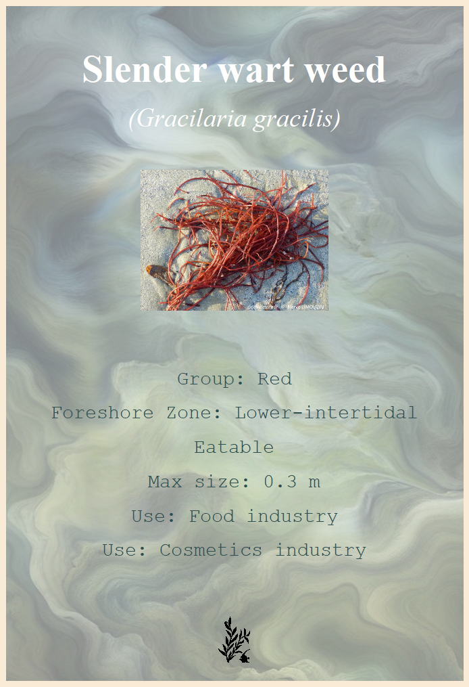

<!-- README.md is generated from README.Rmd. Please edit that file -->

```{r, include = FALSE}
knitr::opts_chunk$set(
  collapse = TRUE,
  comment = "#>",
  fig.path = "man/figures/README-",
  out.width = "100%"
)
```


# Algae package

<!-- badges: start -->
<!-- badges: end -->

The goal of Algae Package is to provide an educational tool for exploring intertidal algae species. It visualizes foreshore layering schemes, provides short descriptive texts, and allows users to interact with algae species through photo cards and data summaries.
...

## Contents

- [Installation](#installation)
- [Functions](#functions)
- [Examples](#example)

## Installation

You can install the development version of package 'Algae' like so:
  devtools::install_github("marine08el/Algae")
  
  Load the package: library(Algae)


## Functions

Three functions provide data on algae:
  
info_algae() : From the vernacular or scientific name of the seaweed, obtain a text summarising its group, its location on the foreshore, whether it is edible or not, its maximum size and its most common human uses.

intertidal_zone() : Simply execute this function to obtain a diagram showing the locations of the algae on the foreshore. The physiological parameters specific to each species of algae react differently to environmental conditions such as light, humidity or salinity, which determines their specific positioning along the foreshore.

algae_card() : After choosing the vernacular or scientific name of the species of algae, this function produces a graphical educational sheet summarising the main characteristics of the algae. 

## Example

Example with the function info_algae("Ulva lactuca")

Response: 
Sea lettuce (*Ulva lactuca*) is a green alga from the mid-intertidal zone.
This algae is eatable.
Its maximum size is 0.4 m.
This algae can be used for : Food industry, Fertilizer. 

Example with the function algae_card("Gracilaria gracilis")

Example with the cards:


```{r example}
library(Algae)
## basic example code
```

